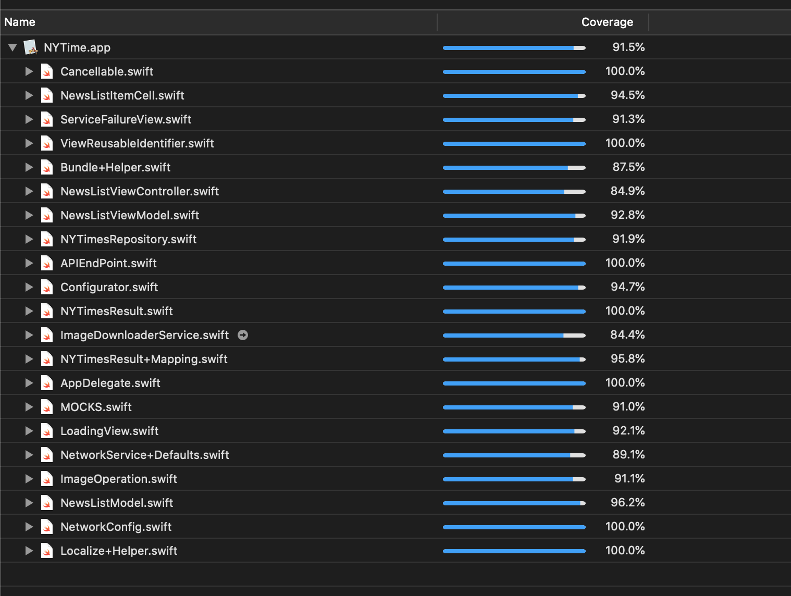

##  PropertyGuru Assessment

NYTimes news list sample app

- Xcode 11.3
- Swift 5
- minimum iOS 11.0

Tried to build on MVVM architecture

###### New york times service
https://developer.nytimes.com

##### Architecture structure.

MVVM - Model View View-model implementation for News list screen. View-model interect with `NewsServiceProvider` repository implementation for api services.

Repository - protocol based services for `NewsListReposity` and `PhotoRepositoryService`.  `NYTimesRepository` implements both servics. `NewsServiceProvider` handle both protocol. Repository interact with Network service implementation.

Network service - Network service & session protocol and implementation for api services.

##### Test coverage.
Current test coverage.

